# ดราฟรายงานโครงงาน FRA503

## ข้อมูลทั่วไป

- ชื่อโครงการ: การพัฒนาระบบจักรยานอัจฉริยะสำหรับตรวจวัดและบันทึกข้อมูลการปั่นผ่าน BLE และคลาวด์
- รายวิชา: FRA503 Technopeuneurship in IoT Industry
- สถานะเอกสาร: Draft Proposal / Draft Report Structure
- ชื่อกลุ่ม: กลุ่ม 2
- ผู้ดำเนินงาน: นายชญานิน นาเพีย รหัสนักศึกษา 65340500009

> หมายเหตุ: เอกสารฉบับนี้เป็นดราฟเพื่อเตรียมการส่ง proposal และ presentation ตามโครงรายงาน 5 บทของรายวิชา จึงตั้งใจไม่ใส่ผลทดลองปลอม แต่จะระบุเป็นแผนการทดสอบและ expected evidence แทน

---

## บทที่ 1 บทนำ

### 1.1 ที่มาและความสำคัญ

จักรยานเป็นพาหนะที่ไม่ก่อมลพิษ มีความคล่องตัว และสามารถใช้งานได้หลากหลายรูปแบบ ทั้งการเดินทางในชีวิตประจำวัน การออกกำลังกาย และการฝึกซ้อมเพื่อการแข่งขัน ผู้ใช้แต่ละกลุ่มจึงมีเป้าหมายในการปั่นและความต้องการข้อมูลที่แตกต่างกันออกไป โดยกลุ่มผู้ใช้จักรยานเป็นพาหนะในชีวิตประจำวันให้ความสำคัญกับความสะดวกและความคุ้มค่า กลุ่มผู้ใช้เพื่อการออกกำลังกายสนใจความหนักเบาของการปั่นและการพัฒนาสมรรถภาพร่างกาย ขณะที่กลุ่มผู้ใช้เพื่อการฝึกซ้อมและการแข่งขันต้องการข้อมูลเชิงลึกเพื่อใช้ควบคุมการซ้อมและวางแผนการใช้พลังงานบนเส้นทางจริง

ในการติดตามประสิทธิภาพการปั่น นักปั่นมักใช้ตัวชี้วัดหลายชนิด เช่น ระยะทาง เวลา ความเร็ว อัตราการเต้นหัวใจเฉลี่ย และกำลังปั่น อย่างไรก็ตาม หากต้องการประเมินความหนักเบาของการออกแรงอย่างใกล้เคียงการใช้พลังงานจริง กำลังปั่นซึ่งหมายถึงอัตราการส่งพลังงานจากผู้ปั่นผ่านขาจานเข้าสู่ระบบขับเคลื่อนของจักรยาน เป็นตัวชี้วัดที่สำคัญกว่าความเร็วหรืออัตราการเต้นหัวใจเพียงอย่างเดียว เนื่องจากความเร็วได้รับผลจากแรงลมและความลาดชันของเส้นทาง ส่วนอัตราการเต้นหัวใจขึ้นกับสภาพร่างกาย การพักผ่อน อุณหภูมิ และโภชนาการ ดังนั้นการทราบค่ากำลังปั่นจึงช่วยให้นักปั่นควบคุมการออกแรงของตนเองและวางแผนการซ้อมได้แม่นยำขึ้น

แม้เครื่องวัดกำลังปั่นจะมีประโยชน์สูง แต่ผลิตภัณฑ์เชิงพาณิชย์ในตลาดยังมีราคาค่อนข้างสูง และหลายแบบมีข้อจำกัดเรื่องความเข้ากันได้กับชิ้นส่วนเดิมของจักรยาน ทำให้ผู้ใช้ทั่วไปและผู้พัฒนาต้นแบบเข้าถึงได้ไม่ง่าย

จากแนวคิดดังกล่าว โครงงานนี้จึงเสนอการพัฒนาระบบจักรยานอัจฉริยะในรูปแบบระบบเสริมที่ติดตั้งบนขาจานข้างเดียว โดยไม่ต้องเปลี่ยนโครงสร้างหลักของจักรยาน ใช้สเตรนเกจและไอเอ็มยูเป็นแหล่งข้อมูลหลัก ใช้ `ESP32` เป็นหน่วยประมวลผลบนตัวจักรยานเพื่อคำนวณค่าเบื้องต้นและสื่อสารผ่าน `Bluetooth Low Energy (BLE)` ไปยังแอปมือถือ จากนั้นแอปมือถือจะทำหน้าที่แสดงผล บันทึกเส้นทาง และส่งข้อมูลขึ้นฐานข้อมูลบนคลาวด์ผ่านเครือข่ายมือถือ

กลุ่มเป้าหมายของระบบในโครงงานนี้แบ่งออกเป็น 3 กลุ่มหลัก ได้แก่

- ผู้ใช้จักรยานเป็นพาหนะในชีวิตประจำวัน
- ผู้ใช้จักรยานเพื่อการออกกำลังกายและดูแลสุขภาพ
- ผู้ใช้จักรยานเพื่อการฝึกซ้อมและการแข่งขัน

### 1.2 ศึกษาคู่แข่งที่มีขาย

โดยทั่วไป watt meter ในจักรยานสามารถแบ่งได้เป็น 4 ประเภทหลัก ได้แก่ `pedal based`, `crank arm based`, `spider based` และ `crankset based` ซึ่งแต่ละประเภทมีจุดเด่นและข้อจำกัดต่างกัน เช่น pedal based ติดตั้งง่ายแต่ขึ้นกับระบบบันไดเดิม, spider based วัดกำลังรวมได้ดีแต่ซับซ้อนด้านการติดตั้ง, และ crankset based มีความครบในตัวแต่มีราคาสูงที่สุด

ตารางต่อไปนี้สรุปข้อดีและข้อจำกัดของ watt meter แต่ละประเภทในมุมที่เกี่ยวข้องกับการพัฒนาต้นแบบ

| ประเภท | ข้อดี | ข้อจำกัด |
| --- | --- | --- |
| Pedal based | ติดตั้งและย้ายข้ามจักรยานได้ค่อนข้างง่าย, วัดแรงจากตำแหน่งที่ผู้ปั่นออกแรงโดยตรง | ต้องเลือกให้เข้ากับระบบบันไดและรองเท้า, โครงสร้างเชิงกลซับซ้อนและรับแรงกระแทกสูง |
| Crank arm based | ต้นทุนต่ำกว่า spider/crankset based, เหมาะกับแนวคิด add-on, ติดตั้ง strain gauge และพัฒนาต้นแบบได้ง่าย | ส่วนใหญ่เป็นการวัดแบบข้างเดียว, ความแม่นยำขึ้นกับการติดตั้งและการคาลิเบรต |
| Spider based | วัดกำลังรวมของระบบขาจานได้ดี, เหมาะกับการใช้งานเชิงสมรรถนะ | การติดตั้งซับซ้อน, ขึ้นกับความเข้ากันได้ของชุดขาจาน, ต้นทุนสูง |
| Crankset based | รวมระบบไว้ในชุดเดียว, ความเรียบร้อยและความพร้อมใช้งานสูง | ราคาสูงที่สุด, ต้องเปลี่ยนชุดขาจานทั้งชุด, ไม่เหมาะกับแนวคิดต้นแบบต้นทุนต่ำ |

สำหรับโครงงานนี้เลือกโฟกัส `crank arm based` เนื่องจากสอดคล้องกับแนวคิด `add-on system` ที่ติดตั้งบน crank arm เดิมได้โดยไม่ต้องเปลี่ยนชิ้นส่วนหลักของจักรยาน มีต้นทุนต่ำกว่า spider/crankset based และเหมาะกับการพัฒนาต้นแบบด้วย `strain gauge + IMU + ESP32` มากที่สุด ดังนั้นตารางเปรียบเทียบด้านล่างจึงคัดข้อมูลเฉพาะ `crank arm power meter` หรือ `left crank arm power meter` เพื่อให้เทียบกับแนวทางของโครงงานได้ตรงที่สุด

| สินค้า | ประเภท | จุดเด่น | ข้อจำกัด | ราคาอ้างอิง |
| --- | --- | --- | --- | ---: |
| Stages Gen 3 Shimano Ultegra R8000 Left Crank Arm | Left crank arm | single-sided ติดตั้งง่าย ใช้กับระบบ Shimano ที่มีอยู่ได้, Accuracy ±1.5%, ANT+/BLE [9][12] | วัดขาเดียวแล้วคูณสอง จึงอาจคลาดเคลื่อนหากแรงซ้าย/ขวาไม่สมดุล | 13,100 บาท [12] |
| 4iiii Precision 3+ Left Arm Only | Left crank arm | เบา, Accuracy ±1%, Battery life สูง, ANT+/BLE, Apple Find My [11] | ยังเป็น single-sided และต้องเลือก arm ให้ตรงรุ่นขาจานเดิม | ประมาณ 14,000-19,354 บาท [11][13] |
| Shimano FC-R9200-P Left Hand Crank Arm Unit | Left crank arm unit | เป็นส่วนหนึ่งของ ecosystem Shimano power meter, ระบุข้อมูล left/right และ compensation เชิงพาณิชย์ [10][14] | ราคาสูง และเป็นชิ้นส่วนเฉพาะรุ่นมากกว่าแนวทาง add-on | ประมาณ 19,040 บาท [14] |

ข้อแตกต่างของโครงงานนี้เมื่อเทียบกับสินค้าในตลาดคือ

- เป็น `add-on sensing system` ที่ติดตั้งบน crank arm เดิม โดยไม่ต้องเปลี่ยนโครงสร้างหลักของจักรยาน
- ใช้ `ESP32 + smartphone + cloud backup` เป็นสถาปัตยกรรมหลัก จึงเน้นความง่ายในการทดลองและการต่อยอดข้อมูล
- เปิดโอกาสให้ปรับแต่งเฟิร์มแวร์ ตรรกะของแอป และลำดับการไหลของข้อมูลได้เอง
- มีข้อจำกัดด้านความแม่นยำและความทนทานมากกว่าระบบ commercial จึงต้องพึ่งการติดตั้งและ calibration ที่เหมาะสม

#### ตัวอย่างข้อมูลราคากลุ่ม crank arm ที่ใช้สร้างกราฟเปรียบเทียบ

| สินค้าในตัวอย่างราคา | ประเภท | ราคา (บาท) | แหล่งข้อมูล |
| --- | --- | ---: | --- |
| Stages Gen 3 Shimano 105 R7000 Left Crank Arm | Left crank arm | 11,800 | Priceza [15] |
| Stages Gen 3 Shimano Ultegra R8000 Left Crank Arm | Left crank arm | 13,100 | Priceza [12] |
| Stages Gen 3 Shimano Ultegra R8100 Left Crank Arm | Left crank arm | 15,224 | Priceza [15] |
| 4iiii Precision 3 Powermeter Ride Ready Left-Side | Left crank arm | 25,783 | Ubuy Thailand [13] |
| 4iiii Precision 3+ 105 R7100 Left Arm Only | Left crank arm | 14,000 | CCACHE, แปลงจาก AUD เป็น THB [11] |
| 4iiii Precision 3+ GRX 810/820 Left Arm Only | Left crank arm | 15,120 | CCACHE, แปลงจาก AUD เป็น THB [16] |
| 4iiii Precision 3+ Ultegra R8100 Left Arm Only | Left crank arm | 16,397 | CCACHE, แปลงจาก AUD เป็น THB [17] |
| 4iiii Precision 3+ Dura-Ace R9200 Left Arm Only | Left crank arm | 17,920 | CCACHE, แปลงจาก AUD เป็น THB [18] |
| Shimano FC-R8100-P Left Hand Crank Arm Unit | Left crank arm unit | 18,390 | CCACHE, แปลงจาก AUD เป็น THB [19] |
| Shimano FC-R9200-P Left Hand Crank Arm Unit | Left crank arm unit | 19,040 | CCACHE, แปลงจาก AUD เป็น THB [14] |

จากตัวอย่าง 10 รายการที่คัดให้เหลือเฉพาะ `crank arm` พบว่าช่วงราคาที่พบบ่อยอยู่ราว `11,800-19,040 บาท` และมีบางรุ่นนำเข้าที่สูงขึ้นไปถึง `25,783 บาท` ภาพนี้ทำให้เห็นชัดว่าต่อให้เปรียบเทียบเฉพาะกลุ่ม crank arm ซึ่งเป็นกลุ่มที่ใกล้กับโครงงานที่สุด ราคาตลาดก็ยังสูงกว่าต้นทุนต้นแบบหลายเท่า

> หมายเหตุด้านข้อมูลราคา: เนื่องจากตลาดไทยสำหรับ `left crank arm power meter` มีรายการที่อ้างอิงได้ไม่มาก จึงใช้ `Priceza/Ubuy Thailand` เป็นหลัก และเสริมด้วย retailer quote ของรุ่น `left arm only` จาก CCACHE แล้วแปลงเป็นบาทที่อัตราประมาณ `1 AUD ≈ 22.4 THB` เพื่อให้เห็นช่วงราคาในกราฟอย่างต่อเนื่อง

### 1.3 วัตถุประสงค์ของผลิตภัณฑ์/สิ่งที่ผลิตภัณฑ์ทำได้ (functions)

- พัฒนาต้นแบบระบบที่สามารถอ่านค่ากำลังปั่นจาก crank arm แบบ add-on โดยไม่มีการถอดเปลี่ยนชิ้นส่วนหลักของจักรยาน
- พัฒนาให้ `ESP32` สามารถรับข้อมูลจาก `strain gauge` และ `IMU` แล้วสื่อสารข้อมูลผ่าน BLE ไปยังแอปมือถือ
- พัฒนาแอปมือถือบนระบบ `Android` สำหรับแสดงผลค่ากำลังปั่นและข้อมูลการปั่นแบบเรียลไทม์
- พัฒนาแอปมือถือให้สามารถส่งข้อมูลขึ้น `cloud database` เพื่อเก็บประวัติการปั่นได้
- ศึกษาความเป็นไปได้เชิงเทคนิค ข้อจำกัด และความเสี่ยงของระบบก่อนพัฒนาต้นแบบจริง

### 1.4 ขอบเขตที่ผลิตภัณฑ์ทำได้

ขอบเขตของงานที่ตั้งใจทำในต้นแบบนี้ประกอบด้วย

- ติดตั้ง strain gauge บน crank arm เดิมเพื่อวัดสัญญาณ deformation
- ใช้ภาคอ่านสัญญาณ เช่น HX711 หรือ ADC front-end เพื่ออ่านค่า strain
- ชิ้นงานเป็น `single crank arm based system`
- โครงจักรยานที่ใช้ในการทดลองเป็นโครงจักรยานพับ รุ่น Fika Frappe
- ใช้ IMU บน crank arm เพื่อวัด `angular velocity`
- ใช้ `ESP32` ที่ติดตั้งบนจักรยานและใช้พลังงานจากแบตเตอรี่เป็นหน่วยประมวลผลหลัก
- ใช้แอปพลิเคชันบนระบบ `Android` เป็นอุปกรณ์ปลายทางของระบบ เพื่อรับข้อมูลผ่าน BLE, แสดงผล, ติดตามเส้นทาง และสำรองข้อมูลขึ้นคลาวด์
- ใช้ `Flutter`, `Google Maps Flutter SDK`, `Geolocator` และ `Firebase` เป็นชุดเทคโนโลยีหลัก
- วางแผนทดสอบเรื่อง calibration, ความเสถียรของการเชื่อมต่อ BLE, การติดตามเส้นทาง, การส่งข้อมูลจากมือถือขึ้นคลาวด์ และการเปรียบเทียบแนวโน้มกับอุปกรณ์อ้างอิง

นอกขอบเขตของ draft นี้

- ไม่รับประกันความแม่นยำระดับ commercial grade
- ยังไม่รวมการผลิต enclosure กันน้ำระดับใช้งานจริงระยะยาว
- ยังไม่รวม dual-sided measurement
- ยังไม่รวมการทำ ANT+ profile เต็มรูปแบบ

### 1.5 ประโยชน์ที่คาดว่าจะได้รับ เช่นจากธุรกิจ

- ได้ต้นแบบ IoT สำหรับการวัดกำลังปั่นที่ต้นทุนต่ำและต่อยอดได้
- ได้สถาปัตยกรรมที่เชื่อม `อุปกรณ์ -> แอปมือถือ -> คลาวด์` อย่างครบวงจร
- ได้ฐานข้อมูลประวัติการปั่นที่นำไปใช้วิเคราะห์พฤติกรรมการปั่นภายหลังได้
- ช่วยลดต้นทุนในการศึกษาหลักการของ power meter เทียบกับการซื้อผลิตภัณฑ์เชิงพาณิชย์โดยตรง
- เหมาะเป็นฐานต่อยอดสำหรับงานวิจัย งานเรียน หรือการพัฒนาผลิตภัณฑ์ sports analytics

### 1.6 แผนดำเนินงาน

แผนดำเนินงานเบื้องต้นของโครงงานครอบคลุมการออกแบบระบบ การพัฒนาฮาร์ดแวร์ การพัฒนาเฟิร์มแวร์บน ESP32 การพัฒนาแอปพลิเคชันบนมือถือ การเชื่อมต่อคลาวด์ และการทดสอบรวมระบบ โดยมีรายละเอียดเชิงเวลาอยู่ในไฟล์แผนงาน [gantt_chart_apr_may_2026_daily_columns.csv](gantt_chart_apr_may_2026_daily_columns.csv) และสามารถสรุปช่วงงานหลักได้ดังนี้

| ช่วงเวลา | งานหลัก |
| --- | --- |
| เมษายน สัปดาห์ที่ 1-2 | ศึกษาความต้องการ ออกแบบสถาปัตยกรรม และวางแผนรายการอุปกรณ์ |
| เมษายน สัปดาห์ที่ 3-4 | ประกอบวงจรเซนเซอร์ ติดตั้ง strain gauge และพัฒนาเฟิร์มแวร์บน ESP32 |
| พฤษภาคม สัปดาห์ที่ 1-2 | พัฒนาแอปมือถือ การติดตามเส้นทาง และการเชื่อมต่อกับแผนที่ |
| พฤษภาคม สัปดาห์ที่ 3 | เชื่อมต่อ Firebase และทดสอบการส่งข้อมูลขึ้นคลาวด์ |
| พฤษภาคม สัปดาห์ที่ 4 | ทดสอบรวมระบบ ปรับแก้ และจัดทำรายงาน/สไลด์นำเสนอ |

---

## บทที่ 2 วิธีการดำเนินการ

### 2.1 แนวคิดการออกแบบและ System Overview

สถาปัตยกรรมของระบบแบ่งเป็น 5 ชั้น ได้แก่ `device layer`, `communication layer`, `service layer`, `application layer` และ `cloud layer` โดยฝั่งจักรยานจะมีเซนเซอร์และวงจรอ่านสัญญาณติดตั้งบน crank arm เดิม ข้อมูลจาก `strain gauge` และ `gyroscope` จะถูกส่งเข้า `ESP32` เพื่อทำ edge power estimation แล้วแพ็กเป็น telemetry packet ส่งผ่าน BLE ไปยังแอปมือถือ หลังจากนั้นมือถือจะรับข้อมูลกำลังปั่น ควบคู่กับการอ่านตำแหน่งจาก GPS เพื่อนำมาสร้างเส้นทาง แสดงผลบนแผนที่ และจัดเก็บเป็นชุดข้อมูลการปั่นก่อนส่งขึ้น Firebase ผ่านเครือข่าย `4G / 5G`

แนวทางนี้มีข้อดีคือ

- ฝั่งจักรยานยังคงความเรียบง่ายและสอดคล้องกับแนวคิด add-on บน crank arm เดิม
- `ESP32` ทำการประมวลผลเบื้องต้นบนอุปกรณ์ จึงลดภาระการคำนวณฝั่งแอปและทำให้ค่ากำลังปั่นพร้อมใช้ทันที
- `BLE` เหมาะกับการเชื่อมต่อระยะสั้นระหว่างจักรยานกับมือถือและกินพลังงานต่ำ [3][4]
- `Flutter + Firebase` ช่วยให้ทำต้นแบบที่มีมือถือเป็นศูนย์กลางและการสำรองข้อมูลขึ้นคลาวด์ได้รวดเร็ว [5][6]
- `Cloud Firestore` รองรับการเก็บข้อมูลแบบออฟไลน์และการซิงก์เมื่อกลับมาออนไลน์ได้ [7]

### 2.2 การเลือกใช้องค์ประกอบของระบบ

| ส่วนของระบบ | องค์ประกอบที่เลือก | เหตุผลเชิงเทคนิค |
| --- | --- | --- |
| Force sensing | Strain gauge บน crank arm เดิม | สอดคล้องกับแนวคิด add-on และไม่ต้องเปลี่ยน drivetrain ทั้งชุด |
| Analog front-end | HX711 หรือ front-end ADC สำหรับ load cell/strain | อ่านสัญญาณระดับเล็กจาก strain gauge ได้ในต้นทุนต่ำ |
| Angular velocity sensing | IMU บน crank arm | ใช้วัดความเร็วเชิงมุมของ crank arm โดยไม่ต้องเพิ่ม sensor อีกชนิด |
| MCU | ESP32 | มี BLE ในตัว ราคาไม่สูง และ ecosystem แข็งแรง |
| Mobile app | Flutter (Android-first) | พัฒนาโปรแกรมฝั่งมือถือได้รวดเร็วและสอดคล้องกับขอบเขตปัจจุบันของโครงงาน |
| Cloud | Firebase Auth + Cloud Firestore | มี SDK ฝั่งมือถือชัดเจน ใช้งานแบบต้นแบบได้เร็ว และมีกฎความปลอดภัยของข้อมูล |

### 2.3 System Diagram

ด้านล่างคือแผนภาพระบบฉบับเดียวกับไฟล์ [bicycle_power_meter_system_diagram.mmd](bicycle_power_meter_system_diagram.mmd)

```mermaid
flowchart LR
  subgraph D["Device Layer"]
    sg["Strain Gauge on Crank Arm"]
    bridge["Wheatstone Bridge"]
    adc["HX711 / ADC Front-End"]
    gyro["Gyroscope (IMU)"]
    esp["ESP32"]
    calib["Calibration"]
    compute["Edge Power Estimation<br/>torque estimate + angular velocity + power estimate"]

    sg -- "strain deformation" --> bridge
    bridge -- "analog bridge signal" --> adc
    adc -- "digital strain reading" --> calib
    calib -- "calibrated strain data" --> esp
    gyro -- "angular velocity signal" --> esp
    esp -- "processed sensor data" --> compute
  end

  subgraph C1["Communication Layer"]
    ble["BLE GAP + GATT"]
    packet["BLE Telemetry Packet<br/>timestamp + strain + angular velocity + power"]
    mobileNet["4G / 5G Mobile Network"]
    https["HTTPS / Firebase API"]
    compute --> packet --> ble
  end

  subgraph S["Service Layer"]
    direction TB

    subgraph SR["Route Service"]
      direction TB
      geo["Flutter Geolocator Plugin<br/>readPositionStream() + location permission"]
      route["Route Tracking<br/>read latitude + longitude + timestamp"]
      polyline["Build Route Polyline<br/>prepare route for map display"]
      mapsdk["Google Maps Flutter SDK<br/>render route on map"]
    end

    subgraph SD["Ride Data Service"]
      direction TB
      powerStore["Power Samples<br/>timestamp + power"]
      merge["Merge Route Data and Power Data<br/>match by timestamp"]
      session["Ride Session Data"]
    end

    subgraph SC["Cloud Sync Service"]
      direction TB
      upload["Firebase Flutter SDK"]
    end
  end

  subgraph A["Application Layer"]
    app["Flutter Mobile App"]
    phoneGps["Phone GPS Sensor"]
    dashboard["Live Dashboard"]
    mapView["Map View"]
    history["Ride History"]
  end

  subgraph CL["Cloud Layer"]
    cloud["Firebase Cloud Firestore"]
  end

  ble -- "BLE notifications" --> app
  app -- "decode telemetry packet" --> powerStore

  phoneGps -- "GPS signal" --> geo
  geo -- "position stream" --> route
  route -- "route points" --> polyline
  polyline -- "polyline data" --> mapsdk
  route -- "route data" --> merge
  powerStore -- "power samples" --> merge
  merge -- "combined session data" --> session

  session -- "ride metrics" --> dashboard
  mapsdk -- "map widget" --> mapView
  session -- "route + power overlay" --> mapView
  session -- "session history" --> history

  session -- "upload request" --> upload
  upload -- "mobile internet" --> mobileNet
  mobileNet -- "HTTPS request" --> https
  https -- "write/read data" --> cloud
```

### 2.4 Interface และ Data Contract เบื้องต้น

#### BLE payload จาก ESP32 ไปยังมือถือ

| Field | Type | ความหมาย |
| --- | --- | --- |
| `device_id` | string | รหัสอุปกรณ์ ESP32 |
| `timestamp_ms` | int64 | เวลาอ่านค่าสัญญาณ |
| `strain_raw` | int32/float | ค่าดิบจาก strain gauge |
| `imu_omega` | float | ความเร็วเชิงมุมที่ได้จาก IMU |
| `power_est_w` | float | ค่ากำลังปั่นที่ระบบประมาณได้ |
| `status_flags` | bitmask | calibration state, signal quality, sync state |

#### โครงสร้างข้อมูลบนคลาวด์เบื้องต้น

| Path | เนื้อหาหลัก |
| --- | --- |
| `/users/{uid}/devices/{deviceId}` | ข้อมูลอุปกรณ์, calibration profile, firmware version |
| `/users/{uid}/rides/{rideId}` | สรุปการปั่น เช่น start/end time, avg power, max power |
| `/users/{uid}/rides/{rideId}/samples/{sampleId}` | time-series sample ของ strain, angular velocity, power และตำแหน่ง |
| `/users/{uid}/rides/{rideId}/route/{pointId}` | จุด route tracking เช่น latitude, longitude, timestamp |

### 2.5 Process Specification

ลำดับการทำงานของระบบมีดังนี้

1. ผู้ใช้ติดตั้ง sensor node บน crank arm และเปิด ESP32
2. ESP32 อ่านค่า strain gauge และ IMU จากนั้นทำ calibration และ filtering เบื้องต้น
3. ESP32 คำนวณ `power estimate = torque estimate x angular velocity`
4. ESP32 ส่งค่า telemetry ผ่าน BLE GATT ไปยังมือถือ
5. แอปมือถือถอดรหัส packet และรับข้อมูลกำลังปั่นพร้อมเวลา
6. แอปใช้ GPS ของมือถืออ่านตำแหน่ง แล้วสร้างข้อมูลติดตามเส้นทางสำหรับรอบการปั่นปัจจุบัน
7. แอปรวมข้อมูลเส้นทางกับข้อมูลกำลังปั่นตามเวลา แล้วแสดงผลในหน้าจอแบบเรียลไทม์ หน้าจอแผนที่ และประวัติการปั่น
8. เมื่อมือถือเชื่อมต่ออินเทอร์เน็ต แอปจะซิงก์ข้อมูลการปั่นไปยัง Cloud Firestore

### 2.6 Domain Specification

| Domain | องค์ประกอบ | บทบาท |
| --- | --- | --- |
| Physical domain | ผู้ปั่น, crank arm, strain gauge, IMU, ESP32, battery | โลกจริงที่สร้างและวัดสัญญาณ |
| Virtual domain | strain_raw, imu_omega, power_est_w, route point, ride session | ตัวแทนข้อมูลของสิ่งที่เกิดขึ้นในโลกจริง |
| Resources | บริการ BLE, ที่เก็บข้อมูลภายในเครื่อง, คอลเลกชันใน Firestore, หน่วยประมวลผลของสมาร์ตโฟน | ทรัพยากรที่ระบบใช้เก็บ ส่ง และประมวลผลข้อมูล |
| Services | การติดตามเส้นทาง, การสร้างเส้นทางสำหรับแผนที่, การรวมข้อมูลเส้นทางกับกำลังปั่น, การซิงก์ขึ้นคลาวด์ | บริการเชิงซอฟต์แวร์ที่สร้างมูลค่าให้ข้อมูล |
| Devices | ESP32 sensing node, smartphone | อุปกรณ์หลักสองตัวของระบบในข้อเสนอฉบับนี้ |

### 2.7 Technical Feasibility

| ประเด็น | เหตุผลที่เป็นไปได้ | ความเสี่ยง | แนวทางลดความเสี่ยง |
| --- | --- | --- | --- |
| Sensing on crank arm | งานอ้างอิง DIY แสดงให้เห็นว่าการวัด deformation บน crank arm สามารถนำมาใช้ประมาณ power ได้ [1] | ตำแหน่งติดตั้งไม่เหมาะสม, signal drift | ทำ jig สำหรับติดตั้ง, zero-offset calibration และยึด sensor ให้ repeatable |
| Angular velocity measurement from IMU | gyroscope ใน IMU สามารถใช้วัดความเร็วเชิงมุมของ crank arm ได้โดยตรง | noise, drift, การยึด sensor ไม่แน่น | ใช้ filtering, calibration และยึด sensor ให้ตำแหน่งคงที่ |
| ESP32 BLE transmission | ESP-IDF รองรับ BLE และ GATT server อย่างเป็นทางการ [3][4] | การหลุดการเชื่อมต่อ, latency, packet loss | ออกแบบ characteristic ให้เล็ก, ทำ reconnect strategy, เก็บ cache ฝั่งมือถือ |
| Mobile app integration | Flutter เชื่อม Firebase ได้ตรงผ่าน FlutterFire [5] | สิทธิ์ Bluetooth และพฤติกรรมการทำงานเบื้องหลังต่างกันในแต่ละแพลตฟอร์ม | เริ่มจาก Android-first และจำกัดขอบเขตให้ชัดก่อนขยายสู่ iOS |
| Cloud backup reliability | Cloud Firestore มีการเก็บข้อมูลแบบออฟไลน์และซิงก์เมื่อกลับมาออนไลน์ [7] | ข้อมูลขัดแย้งกัน, โควตา, ค่าใช้จ่ายเมื่อขยายระบบ | ใช้โครงสร้างข้อมูลแยกตามผู้ใช้ เขียนข้อมูลแบบกลุ่ม และเริ่มจาก Spark plan |
| Route-aware mobile service | แอปสามารถรวมข้อมูลกำลังปั่นกับเส้นทางจาก GPS แล้วสร้างชุดข้อมูลการปั่นเพื่อแสดงบนแผนที่ได้ | เวลาไม่ตรงกัน, ค่าตำแหน่งคลาดเคลื่อน | ใช้เวลาเป็นแกนหลักและบันทึกเส้นทางด้วยช่วงเวลาที่คงที่ |

สรุปเชิงเทคนิคคือโครงงานนี้ `ทำได้จริงในระดับต้นแบบ` หากยอมรับข้อจำกัดด้านความแม่นยำเชิงสัมบูรณ์ และให้ความสำคัญกับ calibration, คุณภาพการติดตั้ง และการกรองสัญญาณอย่างเหมาะสม

### 2.8 การคำนวณกำลังปั่นโดยประมาณ

ระบบนี้ประมาณค่ากำลังปั่นจากเซนเซอร์เพียง 2 ชนิด ได้แก่ `strain gauge` และ `IMU` โดยยึดสมการพื้นฐาน

`Power = Torque x Angular Velocity`

ลำดับการคำนวณมีดังนี้

1. strain gauge วัด deformation ของ crank arm และส่งค่าดิบ `strain_raw`
2. ESP32 ทำการลบ zero offset และกรองสัญญาณ
3. ค่าดังกล่าวถูกแปลงเป็น `torque estimate` ด้วย calibration constant
4. gyroscope ใน IMU วัดการหมุนของ crank arm เพื่อหาค่า `angular velocity`
5. จากนั้นคำนวณ `power estimate = torque estimate x angular velocity`

สมการที่ใช้สามารถเขียนอย่างย่อได้ดังนี้

- `Torque_est = Kt x (strain_raw - zero_offset)`
- `Power_est = Torque_est x omega_imu`

เพื่อให้ค่าที่ได้ใช้งานได้จริงในระดับต้นแบบ ระบบจะใช้การกรองสัญญาณและทำให้ข้อมูลเรียบขึ้นเพิ่มเติมก่อนแสดงผลในแอป โดยจะระบุผลลัพธ์เป็น `estimated power` ไม่ใช่ค่ามาตรฐานเชิงพาณิชย์แบบสัมบูรณ์

### 2.9 แนวทางตอบ requirement เรื่องความฉลาดของระบบแบบ 1B

โครงงานนี้เลือกตีความ requirement ด้านความฉลาดของระบบในรูปแบบ `decision support system` แทนการให้ระบบตัดสินใจแทนผู้ใช้ทั้งหมด กล่าวคือ แอปจะไม่แสดงเพียงค่ากำลังปั่น แต่จะวิเคราะห์ข้อมูลจากหลายองค์ประกอบร่วมกัน ได้แก่

- strain magnitude และ strain noise
- angular velocity และความสม่ำเสมอของการหมุนจาก IMU
- ความสอดคล้องระหว่างรูปแบบแรงกับรูปแบบการหมุนของ crank arm
- สถานะการคาลิเบรตของ sensor

ข้อมูลข้างต้นจะผ่านกระบวนการมากกว่า rule base ตรง ๆ เช่น filtering, moving average, variance analysis และ confidence scoring แล้วสรุปผลเป็น

- `measurement confidence`
- `rotation stability`
- `recalibration recommendation`
- `accept data / inspect mounting`

แนวทางนี้ทำให้ระบบตรงกับ requirement แบบ `1B` คือใช้การวิเคราะห์ข้อมูลเพื่อสนับสนุนการตัดสินใจของผู้ใช้ โดยไม่ใช่เพียง if-then rule แบบตัวแปรเดี่ยว

### 2.10 Security Considerations

- ใช้ BLE แบบ known-device pairing assumption และ whitelist `device_id` ของ ESP32 ที่แอปยอมรับ
- ใช้ Firebase Authentication เพื่อแยกข้อมูลตามผู้ใช้
- ใช้ Cloud Firestore Security Rules บังคับว่าอ่าน/เขียนได้เฉพาะ document ของตนเอง
- ไม่ hard-code secret key ไว้ใน firmware หรือ source ของแอป
- ตรวจสอบชนิดข้อมูลและช่วงค่าเบื้องต้นก่อนส่งขึ้น cloud เพื่อลด malformed payload

### 2.11 Requirement Coverage Checklist

| Requirement จากวิชา | การตอบโจทย์ในดราฟนี้ |
| --- | --- |
| Devices อย่างน้อย 2 ตัว | ใช้ ESP32 sensing node + smartphone เป็นอุปกรณ์หลัก 2 ตัว |
| Communication | ใช้ BLE ระหว่าง ESP32 กับมือถือ และ HTTPS/Firebase ระหว่างมือถือกับคลาวด์ |
| Security | มี BLE pairing assumption, การยืนยันตัวตนฝั่งแอป, Firestore rules |
| มีตัวตรวจจับและสั่งการ/actuate | sensing node ตรวจจับข้อมูล และมือถือทำหน้าที่ให้ recommendation/notification แก่ผู้ใช้เป็น actuation ฝั่งปลายทาง |
| Problem/Solution fit | บทที่ 1 อธิบาย pain point เรื่องต้นทุนของ power meter และแนวทางแก้ |
| Alternative solutions | บทที่ 1.2 |
| Technical feasibility | บทที่ 2.7 |
| Intelligent / decision support requirement | บทที่ 2.9 |
| Process specification | บทที่ 2.5 |
| Domain specification | บทที่ 2.6 |
| Testing | บทที่ 3 |
| Budget plan | บทที่ 5 |

> ข้อสังเกต: หากอาจารย์ตีความว่าต้องมี `2 embedded devices` อย่างชัดเจน แผนต่อยอดที่แนะนำคือเพิ่ม `handlebar alert node` หรือ `BLE display node` เป็นอุปกรณ์ลำดับถัดไป

### 2.12 แผนการดำเนินงาน

| สัปดาห์ | งานหลัก | Deliverable |
| --- | --- | --- |
| 1 | ศึกษา reference, competitor, requirement และออกแบบตำแหน่งติดตั้ง sensor | System concept + requirement map |
| 2 | ทดสอบการติดตั้ง strain gauge และวงจรอ่านสัญญาณ | Bench-test ของ force signal |
| 3 | พัฒนาเฟิร์มแวร์บน ESP32 และแพ็กเก็ต BLE | ต้นแบบ sensing node |
| 4 | พัฒนาแอป Flutter และโครงสร้างข้อมูลบน Firebase | หน้าจอแสดงผลบนมือถือและการเชื่อมต่อคลาวด์ |
| 5 | รวมระบบ ปรับ calibration ทดสอบการเก็บข้อมูลแบบออฟไลน์และการซิงก์ | ต้นแบบที่เชื่อมต่อครบวงจร |
| 6 | ทดสอบภาคสนาม วิเคราะห์ข้อจำกัด จัดทำรายงานและสไลด์ | ดราฟสุดท้ายสำหรับนำเสนอ |

การแบ่งงานภายในกลุ่มสามารถใช้โครงนี้เป็นค่าเริ่มต้น

- สมาชิก A: hardware + sensor integration
- สมาชิก B: เฟิร์มแวร์ + BLE
- สมาชิก C: แอปมือถือ + คลาวด์ + การทดสอบ/เอกสาร

ถ้าเป็นกลุ่มขนาดเล็กกว่านี้สามารถรวมบทบาทเข้าด้วยกันได้

---

## บทที่ 3 วิธีการทดสอบ ผลและวิเคราะห์การทดสอบ

> บทนี้ใน draft ฉบับนี้เป็น `แผนการทดสอบ` และ `expected evidence` ไม่ใช่ผลทดลองจริง

### 3.1 เป้าหมายการทดสอบ

- ตรวจสอบว่าระบบอ่านสัญญาณจาก crank arm ได้สม่ำเสมอ
- ตรวจสอบว่า ESP32 ส่งข้อมูลผ่าน BLE ไปยังมือถือได้ต่อเนื่อง
- ตรวจสอบว่าแอปมือถือเก็บเส้นทางและรวมกับข้อมูลกำลังปั่นได้ถูกต้อง
- ตรวจสอบว่าแอปมือถือเก็บข้อมูลชั่วคราวและซิงก์ขึ้นคลาวด์ได้
- ประเมินข้อจำกัดด้าน calibration, latency และการวัด angular velocity จาก IMU

### 3.2 แผนการทดสอบ

| Test ID | รายการทดสอบ | วิธีการ | หลักฐานที่คาดหวัง |
| --- | --- | --- | --- |
| T1 | Zero-offset calibration | วัดค่าขณะไม่มีแรงกดซ้ำหลายรอบ | ค่าดิบมี baseline ที่เสถียร |
| T2 | Known-load calibration | ใช้น้ำหนักหรือแรงคงที่ที่รู้ค่าเทียบกับ output | ได้ scale factor สำหรับแปลง force_raw |
| T3 | ความเสถียรของ BLE | ปั่นต่อเนื่อง 20-30 นาที | การสูญหายของแพ็กเก็ตต่ำ และเชื่อมต่อใหม่ได้เมื่อหลุด |
| T4 | การติดตามเส้นทางและซิงก์ขึ้นคลาวด์ | ปิดอินเทอร์เน็ตระหว่างปั่นแล้วเปิดภายหลัง | ข้อมูลเส้นทางและกำลังปั่นถูกซิงก์กลับไปยังคลาวด์ครบถ้วน |
| T5 | IMU angular velocity validation | เปรียบเทียบค่า angular velocity กับการหมุนจริงของ crank arm | แนวโน้มการหมุนสอดคล้องในระดับ prototype |
| T6 | การเปรียบเทียบกับอุปกรณ์อ้างอิง | เปรียบเทียบแนวโน้มกับ smart trainer หรือ commercial meter | แนวโน้มสอดคล้องกันในระดับต้นแบบ |
| T7 | การรวมข้อมูลเส้นทางกับกำลังปั่น | ตรวจสอบการจับคู่ข้อมูลเส้นทางกับกำลังปั่นตามเวลา | ชุดข้อมูลการปั่นที่ได้มีลำดับถูกต้องและแสดงผลได้ |

### 3.3 แนวทางวิเคราะห์ผล

ตัวชี้วัดหลักที่ควรเก็บเพื่อวิเคราะห์ผล ได้แก่

- ค่า drift ของ zero offset ตามเวลา
- ค่าเฉลี่ยและส่วนเบี่ยงเบนของช่วงเวลาระหว่างแพ็กเก็ต
- จำนวนตัวอย่างข้อมูลที่ค้างในหน่วยเก็บชั่วคราวภายในเครื่อง และระยะเวลาที่ใช้ในการซิงก์
- ความต่างเชิงแนวโน้มเมื่อเทียบกับอุปกรณ์ reference
- ความต่างของ angular velocity จาก IMU เทียบกับค่าอ้างอิง
- การเปลี่ยนแปลงของ confidence score เมื่อ sensor quality ลดลง

หากผลออกมาว่าค่ากำลังปั่นยังไม่นิ่ง แต่แนวโน้มยังสอดคล้องกับ effort ของผู้ปั่น ระบบนี้ยังถือว่ามีคุณค่าในฐานะ `ต้นแบบระดับรายวิชา` และสามารถต่อยอดในรอบถัดไปได้

---

## บทที่ 4 สรุปผลการดำเนินงาน และข้อเสนอแนะ

โครงงานนี้เสนอการพัฒนาระบบจักรยานอัจฉริยะสำหรับตรวจวัดและบันทึกข้อมูลการปั่นในรูปแบบ add-on ที่ใช้ crank arm เดิมเป็นฐานติดตั้ง strain gauge และใช้ ESP32 เป็นแกนหลักของ sensing node เพื่อคำนวณค่ากำลังปั่นเบื้องต้นและส่งข้อมูลผ่าน BLE ไปยังแอปมือถือ จากนั้นมือถือจะทำหน้าที่รับข้อมูลเส้นทางจาก GPS แสดงผลบนแผนที่ และเป็น gateway สำหรับสำรองข้อมูลขึ้นคลาวด์

จุดแข็งของแนวคิดนี้คือ

- ต้นทุนต่ำกว่าการซื้อ power meter เชิงพาณิชย์มาก
- ไม่ต้องเปลี่ยน crankset หรือโครงสร้างหลักของจักรยาน
- มีสถาปัตยกรรม IoT ครบทั้ง sensing, communication, application, service และ cloud
- เหมาะกับการเรียนรู้และต่อยอดด้าน sports analytics

ข้อจำกัดที่คาดไว้

- ความแม่นยำขึ้นกับคุณภาพการติดตั้ง strain gauge และ calibration อย่างมาก
- ระบบใน draft นี้ยังพึ่ง smartphone เป็นอุปกรณ์ปลายทางตัวที่สอง ไม่ใช่ embedded actuator node แยก
- ความทนทานต่อฝน แรงสั่นสะเทือน และสภาพแวดล้อมจริงยังต้องพิสูจน์เพิ่มเติม

ข้อเสนอแนะในการพัฒนาต่อ

- เพิ่ม `handlebar alert node` หรือ BLE head unit เพื่อให้ requirement เรื่อง 2 devices แข็งแรงขึ้น
- พัฒนา algorithm สำหรับการวัด angular velocity จาก IMU ให้เสถียรมากขึ้น
- พัฒนาชุดติดตั้ง sensor ให้ repeatable มากขึ้น
- เพิ่มการเปรียบเทียบกับ commercial meter หลายช่วงกำลังปั่น
- หาก prototype มีเสถียรภาพพอ สามารถต่อยอดไปสู่ ANT+ compatibility หรือ advanced analytics ได้

---

## บทที่ 5 แผนการเงิน

> ตารางนี้เป็นงบประมาณประมาณการสำหรับ prototype รุ่นแรก

| รายการ | จำนวน | ราคาต่อหน่วย (บาท) | ราคารวม (บาท) | หมายเหตุ |
| --- | ---: | ---: | ---: | --- |
| ESP32 Dev Board | 1 | 100 | 100 | MCU หลักสำหรับอ่านเซนเซอร์และส่ง BLE |
| Strain gauge | 4 | 12 | 48 | ติดตั้งบน crank arm |
| HX711 | 1 | 50 | 50 | อ่านสัญญาณจาก strain gauge |
| MPU6050 | 1 | 90 | 90 | ใช้วัด angular velocity จาก IMU |
| Battery 7.4V | 1 | 350 | 350 | แหล่งจ่ายพลังงานของอุปกรณ์ |
| PLA+ filament | 1 | 500 | 500 | พิมพ์ชิ้นส่วนยึดและ housing เบื้องต้น |
| Wiring / connectors | 1 | 200 | 200 | ใช้ต่อวงจรและเชื่อมอุปกรณ์ |
| Step-down 5V | 1 | 40 | 40 | ปรับแรงดันไฟให้เหมาะกับระบบ |
| Firebase (prototype tier) | 1 | 0 | 0 | ใช้บริการระดับฟรีในช่วงต้นแบบ |
| **รวม** |  |  | **1,378** | ประมาณการเบื้องต้นตามรายการอุปกรณ์ปัจจุบัน |

---

## อ้างอิง

1. Steve Jarvis, “Homemade Power Meter,” available: <https://imateapot.dev/homemade-power-meter/> (accessed 2026-04-09).
2. YouTube reference provided by project owner, available: <https://www.youtube.com/watch?v=CRa9djnZRu0&t=11s> (accessed 2026-04-09).
3. Espressif, “Bluetooth API - ESP32,” available: <https://docs.espressif.com/projects/esp-idf/en/stable/esp32/api-reference/bluetooth/index.html> (accessed 2026-04-09).
4. Espressif, “GATT Server API - ESP32,” available: <https://docs.espressif.com/projects/esp-idf/en/stable/esp32/api-reference/bluetooth/esp_gatts.html> (accessed 2026-04-09).
5. Firebase, “Add Firebase to your Flutter app,” available: <https://firebase.google.com/docs/flutter/setup> (accessed 2026-04-09).
6. Firebase, “Cloud Firestore,” available: <https://firebase.google.com/products/firestore> (accessed 2026-04-09).
7. Firebase, “Access data offline,” available: <https://firebase.google.com/docs/firestore/manage-data/enable-offline> (accessed 2026-04-09).
8. Firebase, “Get started with Cloud Firestore Security Rules,” available: <https://firebase.google.com/docs/firestore/security/get-started> (accessed 2026-04-09).
9. Stages Cycling, “Single Sided Power Meters,” available: <https://stagescycling.com/en_global/product/power-meters/single-sided> (accessed 2026-04-09).
10. Shimano, “FC-R9200-P,” available: <https://bike.shimano.com/pl-PL/products/components/pdp.P-FC-R9200-P.html> (accessed 2026-04-09).
11. CCACHE, “4iiii Precision 3+ Power Meter Left Arm Only - 105 R7100,” available: <https://ccache.cc/products/4iiii-precision-3-power-meter-left-arm-only-105-r7100> (accessed 2026-04-09).
12. Priceza, “ขาวัตต์ Stages Ultegra R8000,” available: <https://www.priceza.com/s/%E0%B8%A3%E0%B8%B2%E0%B8%84%E0%B8%B2/%E0%B8%82%E0%B8%B2%E0%B8%A7%E0%B8%B1%E0%B8%95%E0%B8%95%E0%B9%8Cstages-ultegra-r8000> (accessed 2026-04-09).
13. Ubuy Thailand, “4iiii Precision 3 Powermeter Ride Ready - Left-Side,” available: <https://www.ubuy.co.th/th/product/IEUP1SR62-4iiii-precision-3-powermeter-ride-ready-left-side-ant-performance-meter-for-outdoor-indoor-cycling-measures-watts-cadence-calories> (accessed 2026-04-09).
14. CCACHE, “Shimano Dura-Ace FC-R9200-P Left Hand Crank Arm Unit,” available: <https://ccache.cc/products/shimano-dura-ace-fc-r9200-p-left-hand-crank-arm-powermeter> (accessed 2026-04-09).
15. Priceza, “ขาจาน 105,” available: <https://www.priceza.com/s/%E0%B8%A3%E0%B8%B2%E0%B8%84%E0%B8%B2/%E0%B8%82%E0%B8%B2%E0%B8%88%E0%B8%B2%E0%B8%99105> (accessed 2026-04-09).
16. CCACHE, “4iiii Precision 3+ Power Meter Left Arm Only - GRX 810/820,” available: <https://ccache.cc/products/4iiii-precision-3-power-meter-left-arm-only-grx-810-820> (accessed 2026-04-09).
17. CCACHE, “4iiii Precision 3+ Power Meter Left Arm Only - Ultegra R8100,” available: <https://ccache.cc/products/4iiii-precision-3-power-meter-left-arm-only-ultegra-r8100> (accessed 2026-04-09).
18. CCACHE, “4iiii Precision 3+ Power Meter Left Arm Only - Dura-Ace R9200,” available: <https://ccache.cc/products/4iiii-precision-3-power-meter-left-arm-only-dura-ace-r9200> (accessed 2026-04-09).
19. CCACHE, “Shimano FC-R8100-P Left Hand Crank Arm Unit 172.5mm,” available: <https://ccache.cc/products/shimano-fc-r8100-p-left-hand-crank-arm-unit-172-5mm> (accessed 2026-04-09).
